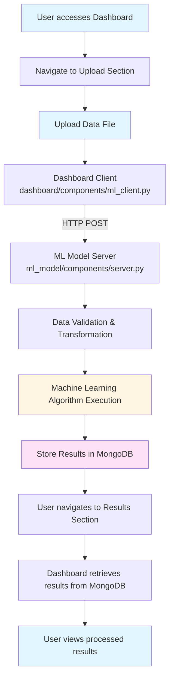

# Presentation (portuguese)

Este é um Projeto Integrador relativo ao Segundo Semestre 2025, da Escola Politecnica PUC Campinas. Tem como objetivo desenvolver uma aplicação que reúne conceitos de 3 matérias distintas (Computação em Nuvem, Transformação de Dados e Aprendizado Supervisionado)

# Project Structure

This repository is organized into two microservice applications: one for user-facing operations and another for back-end processing. Details below.


## Microservice 1 (dashboard app)
`dashboard/` is a user-interactive web application where users can:

- Upload data files (which are sent to the ML microservice);
- View results from data processing operations executed by the ML microservice.

Data operations occur through a client interface that sends data via HTTP POST requests to the ML microservice, and by accessing a MongoDB connection to retrieve processing results.


## Microservice 2 (machine learning model app)
`ml_model/` is responsible for executing machine learning algorithms on data files uploaded through the dashboard. The process works as follows:

- A simple HTTP server listens for POST requests from the dashboard, expecting to receive a data object defined in the `models/` folder;
- Data operations verify, transform, and prepare the data before running the machine learning algorithm;
- After execution, results are stored in MongoDB.


## Special Considerations
The `models/` folder serves both microservices, providing shared resources for:
- Database connection utilities (MongoDB);
- Common data transformation operations (data is transformed in the dashboard service and re-transformed in the ml_model service).


## Project Pipeline
The following diagram illustrates the end-user workflow:



## CI/CD Pipeline

The project follows a three-stage deployment workflow, progressing from local development to Azure production.

### Environments

| Environment | Database | Compose File | Image Tag | Purpose |
|-------------|----------|--------------|-----------|---------|
| **dev** | Local MongoDB | `docker-compose.dev.yml` | `:dev` | Fast local iteration |
| **staging** | Azure CosmosDB | `docker-compose.staging.yml` | `:staging` | Pre-deployment validation |
| **azure** | Azure CosmosDB | Container Apps | versioned | Production |

Staging connects to the same CosmosDB as production, allowing validation of database behavior before deploying to Azure Container Apps.

### Makefile
Commands are organized by environment prefix (`dev-*`, `staging-*`, `azure-*`):

```bash
make help           # Show all commands
make dev-up         # Start dev environment
make staging-up     # Start staging (requires CosmosDB credentials in .env)
make azure-deploy   # Full Azure deployment
```

### Image Builds
Development and staging use simple tags (`:dev`, `:staging`). Azure builds use versioned tags via `scripts/version.sh` for ACR traceability.

```bash
chmod +x scripts/version.sh   # Make executable before first use
chmod +x scripts/azure-preflisht.sh # To easily production setup ('make azure-' directives use it...)
```