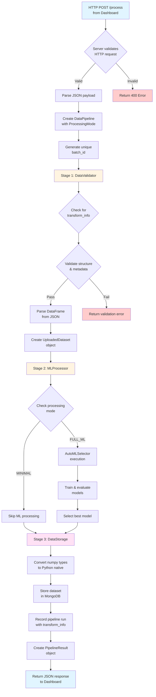

# ML Model Service

Machine learning model service for data processing and analysis.

## Structure

```
ml_model/
├── main.py              # Service entry point (starts HTTP server)
├── requirements.txt     # Python dependencies
└── components/          # Core components
    ├── server.py        # HTTP server for receiving requests
    ├── data_processor.py # Pipeline orchestrator and data storage
    └── analyses_ml.py   # ML algorithms and model selection
```

## Overview

The ML service is a standalone HTTP server that receives datasets from the dashboard, processes them through a structured pipeline, and stores results in MongoDB.

**Architecture:**
```
HTTP Request → Server → DataPipeline → [Validation → ML Processing → MongoDB Storage]
```

**Implementation Status:**
- [x] HTTP server with health checks and data endpoints
- [x] Pipeline orchestration with stage-by-stage execution
- [x] Data validation and structure verification
- [x] MongoDB integration for datasets and pipeline runs
- [x] Automatic numpy type conversion for database compatibility
- [x] Comprehensive error handling and logging
- [x] Standardized response format
- [ ] ML processing (AutoMLSelector ready, not yet integrated)

## HTTP Server

### server.py

Minimal HTTP server using Python's built-in `http.server` module. Delegates all processing to the DataPipeline.

**Endpoints:**

```
GET /health
GET /
  Returns service health status
  Response: {"status": "healthy", "service": "ml-model", ...}

POST /process
  Accepts dataset for processing through the pipeline
  Request body: {
    "filename": str,
    "data": str (JSON-encoded DataFrame),
    "metadata": {
      "row_count": int,
      "column_count": int,
      "column_names": list,
      "file_type": str,
      "has_missing_values": bool
    },
    "transform_info": {  # Optional, from dashboard pipeline
      "transform_status": str ("skipped", "completed"),
      "mode": str ("none", "basic", "full"),
      "original_shape": tuple (optional)
    }
  }
  Response: {
    "status": "completed",
    "message": "Dataset processed and stored successfully",
    "timestamp": ISO datetime,
    "batch_id": str,
    "row_count": int,
    "column_count": int,
    "filename": str,
    "storage_location": "mongodb://datasets",
    "ml_processing": {...},
    "processing_summary": {...}
  }
```

**Key Features:**
- Delegates all validation and processing to DataPipeline
- Comprehensive request/response logging with visual indicators
- JSON parsing and error handling
- Support for large payloads (tested up to 50MB)
- No external framework dependencies

**Starting the Server:**
```python
from ml_model.components.server import start_server

# Start on default port 5000
start_server()

# Custom host/port
start_server(host='0.0.0.0', port=8080)
```

## Data Processing Pipeline

### data_processor.py

Pipeline orchestrator that coordinates all processing stages with clear separation of concerns.

**Architecture:**
```
DataPipeline
├── DataValidator     # Stage 1: Validate incoming data
├── MLProcessor       # Stage 2: Machine learning processing
└── DataStorage       # Stage 3: MongoDB persistence
```

**DataPipeline Class:**

Orchestrates the complete data flow from receipt to storage.

```python
from ml_model.components.data_processor import DataPipeline, ProcessingMode

# Initialize pipeline
pipeline = DataPipeline(mode=ProcessingMode.MINIMAL)

# Execute pipeline
result = pipeline.execute(data)

# Result is a PipelineResult object with:
# - status: "completed" or "failed"
# - message: Human-readable message
# - batch_id: Unique identifier for this run
# - data: Processing results and metadata
# - errors: List of errors if failed
```

**Processing Modes:**
- `MINIMAL`: Validate and store only (current default)
- `ANALYSIS`: Basic statistical analysis
- `FULL_ML`: Complete ML pipeline with AutoMLSelector

**DataValidator:**

Validates incoming data structure and content.

- Detects transformation metadata from dashboard pipeline
- Checks required fields (filename, data, metadata)
- Validates metadata structure
- Enforces size limits (1M rows, 1K columns max)
- Parses JSON to pandas DataFrame
- Creates UploadedDataset objects

Transformation awareness:
```python
# Automatically detects if data has been transformed
transform_info = data.get('transform_info', {})
if transform_info.get('transform_status') == 'completed':
    # Logs transformation details
    # Ready for inverse transformation when needed
elif transform_info.get('transform_status') == 'skipped':
    # Processes data normally
```

**MLProcessor:**

Machine learning processing stage (placeholder for AutoMLSelector integration).

Currently operates in MINIMAL mode (skips ML processing). The AutoMLSelector component is ready for integration when needed.

**DataStorage:**

Handles all MongoDB operations.

```python
# Collections managed:
- datasets            # Raw uploaded datasets
- pipeline_runs       # Pipeline execution tracking
- ml_results          # ML processing results (reserved)

# Storage operations:
storage.store_dataset(dataset, batch_id)      # Stores dataset
storage.store_pipeline_run(batch_id, status, summary)  # Tracks execution
storage.get_dataset(batch_id)                 # Retrieves dataset
```

**Key Features:**
- Automatic conversion of numpy types to native Python types
- Stage-by-stage error handling
- Unique batch ID generation
- Pipeline run tracking for observability
- Standardized result objects

## ML Components

### analyses_ml.py

Automated ML model selection and training component (ready for integration).

**AutoMLSelector Class:**

```python
from ml_model.components.analyses_ml import AutoMLSelector

# Initialize selector
selector = AutoMLSelector(
    target_column='target',
    cv_folds=5
)

# Fit models
selector.fit(dataframe)

# Get results
results = selector.get_results_summary()

# Make predictions
predictions = selector.predict(X_test)
```

**Features:**
- Auto-detection of problem type (regression vs classification)
- 8 regression algorithms (Linear, Ridge, Lasso, Random Forest, Gradient Boosting, etc.)
- 6 classification algorithms (Logistic, Random Forest, SVC, Decision Tree, etc.)
- K-Fold cross-validation (5 folds default)
- Comprehensive metrics (R², MAE, accuracy, F1-score, etc.)
- Overfitting detection
- Error range calculation for predictions

## MongoDB Integration

The service stores data in MongoDB with the following schema:

**datasets Collection:**
```javascript
{
  _id: "20251108_193036_filename_csv_hash",  // batch_id
  filename: "data.csv",
  file_type: "csv",
  upload_timestamp: ISODate("2025-11-08T19:30:36Z"),
  metadata: {
    row_count: 1000,
    column_count: 15,
    column_names: ["col1", "col2", ...],
    has_missing_values: false,
    // ... additional metadata
  },
  data: [
    {col1: value1, col2: value2, ...},
    // ... all rows
  ],
  created_at: ISODate("2025-11-08T19:30:36Z"),
  processing_status: "stored"
}
```

**pipeline_runs Collection:**
```javascript
{
  batch_id: "20251108_193036_filename_csv_hash",
  status: "completed",  // or "failed"
  started_at: ISODate("2025-11-08T19:30:36Z"),
  completed_at: ISODate("2025-11-08T19:30:37Z"),
  summary: {
    filename: "data.csv",
    rows_processed: 1000,
    columns_processed: 15,
    has_missing_values: false,
    ml_status: "skipped",
    processing_mode: "minimal",
    storage_status: "success",
    transform_status: "skipped",  // From dashboard pipeline
    transform_mode: "none"         // Transformation mode used
  },
  errors: [],  // Array of error objects if failed
  metadata: {
    processor_version: "1.0.0",
    storage_version: "1.0.0"
  }
}
```

**Connection Configuration:**

Environment variables (set in docker-compose.dev.yml):
```bash
MONGO_HOST=mongodb
MONGO_PORT=27017
MONGO_DATABASE=pi2502
MONGO_USER=root
MONGO_PASSWORD=root_password123
MONGO_AUTH_SOURCE=admin
```

## Development Guide

### Current Data Flow

```
1. Dashboard sends POST /process with dataset and optional transform_info
2. Server parses JSON and logs request
3. Server delegates to DataPipeline
4. DataPipeline executes stages:
   a. DataValidator validates structure and detects transformation
   b. MLProcessor runs (currently skips in MINIMAL mode)
   c. DataStorage stores in MongoDB
   d. Pipeline run recorded with transformation metadata
5. Server returns standardized result to dashboard
```

### Adding ML Processing

To enable ML processing in the pipeline:

1. Change processing mode from MINIMAL to FULL_ML:
```python
# In server.py, line 195
pipeline = DataPipeline(mode=ProcessingMode.FULL_ML)
```

2. Update MLProcessor.process() in data_processor.py:
```python
def process(self, dataset: UploadedDataset, batch_id: str) -> Dict:
    if self.mode == ProcessingMode.FULL_ML:
        from ml_model.components.analyses_ml import AutoMLSelector

        # Run AutoML
        selector = AutoMLSelector(target_column='target_col')
        selector.fit(dataset.raw_dataframe)
        results = selector.get_results_summary()

        # Store results in ml_results collection
        # Return results
        return {
            "ml_status": "completed",
            "best_model": selector.best_model_name,
            "results": results.to_dict()
        }
```

3. Specify target column (could be from request metadata)

### Extending the Pipeline

To add new processing stages:

1. Create new processor class (e.g., FeatureEngineer)
2. Initialize in DataPipeline.__init__()
3. Call in DataPipeline.execute() as a new stage
4. Handle errors at stage level
5. Include results in final PipelineResult

## Logging

The service uses detailed console logging for debugging:

**Log Indicators:**
- 🟢 Server startup and health checks
- 🔵 Incoming requests and processing steps
- 🔴 Errors and exceptions
- 🟡 Warnings

**Log Format:**
```
[PIPELINE] Starting execution - Batch ID: 20251108_193036_...
[STAGE 1] Data Validation
[VALIDATION] ✅ Passed
[STAGE 2] ML Processing
[ML PROCESSOR] ⏭️ Skipped (minimal mode)
[STAGE 3] Data Storage
[STORAGE] ✅ Dataset stored in MongoDB
```

## Testing

**Manual Testing via Streamlit Dashboard:**

1. Start services: `make dev-up`
2. Open dashboard: http://localhost:8501
3. Navigate to "Upload Data" page
4. Upload CSV or Excel file
5. Monitor ML service logs: `make dev-logs-ml`

**Expected Response:**
```json
{
  "status": "completed",
  "message": "Dataset processed and stored successfully",
  "timestamp": "2025-11-08T19:30:36.123456",
  "batch_id": "20251108_193036_data_csv_a1b2c3d4",
  "row_count": 1000,
  "column_count": 15,
  "filename": "data.csv",
  "storage_location": "mongodb://datasets",
  "ml_processing": {
    "ml_status": "skipped",
    "mode": "minimal",
    "reason": "Minimal mode - ML processing disabled"
  },
  "processing_summary": {
    "filename": "data.csv",
    "rows_processed": 1000,
    "columns_processed": 15,
    "has_missing_values": false,
    "ml_status": "skipped",
    "processing_mode": "minimal",
    "storage_status": "success",
    "transform_status": "skipped",
    "transform_mode": "none"
  }
}
```

**Verify in MongoDB:**
```bash
# Connect to MongoDB
docker exec -it mongodb_dev mongosh -u root -p root_password123 --authenticationDatabase admin

# Check datasets
use pi2502
db.datasets.find().pretty()
db.pipeline_runs.find().pretty()
```

## Internal Processing Pipeline

The following diagram illustrates the complete internal flow when the ML service receives an HTTP POST request:


